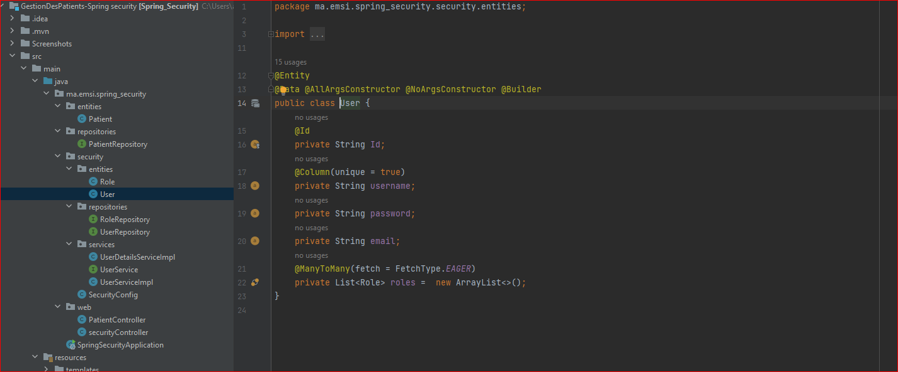
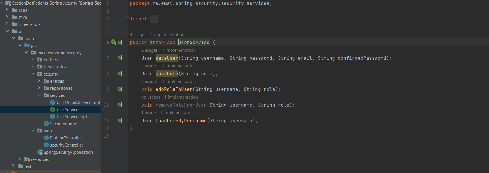

<h2>Gestion des Patient avec Spring Security 6</h2>

• Spring Security a une architecture conçue pour séparer l'authentification de
l'autorisation et offre des stratégies extensibles pour les deux.  
• Spring Security est un module de Spring qui permet de sécuriser les
applications Web.  
• Spring Security configure des filtres (springSecurityFilterChain) qui permet
d’intercepter les requêtes HTTP et de vérifier si l’utilisateur authentifié dispose
des droits d’accès à la ressource demandée.  
• Les actions du contrôleur ne seront invoquées que si l’utilisateur authentifié
dispose de l’un des rôles attribués à l’action.  
• Spring Security peut configurer les rôles associés aux utilisateurs en utilisant
différentes solution (inMemory, JDBC, UserDetails, etc..)

<h3>- InMemory Authentication method :</h3>

<h4>Protection des methodes avec l'annotation "@PreAuthorize".</h4>

<h3>- JDBC Authentication method :</h3>
<h4>JDBC Bean permettant la connexion avec la base de données via l'objet dataSource.</h4>
<h4>La Création des users avec leurs roles au démarrage de l'application via le JDBC Bean crée.</h4>

<h4>Le Fichier schema.sql contenant les requêttes permettant la création des tables users et authorities et un index sur leurs colonnes.</h4>

<h4>Pour que Spring crée les tables users et roles á partir du fichier schema.sql, il faut la préciser dans application.properties.</h4>

<h3>- UserDetails Authentication method :</h3>
<h4>L'entité User :</h4>

<h4>L'entité Role :</h4>

<h4>L'interface UserRepository :</h4>

<h4>L'interface UserService :</h4>

<h4>La Création des users et des roles et affecter les roles au users.</h4>

<h4>L'implémentation de l'interface UserDetailsService :</h4>

<h4>Il faut configurer aussi le fichier application.properties.</h4>

<h2>Captures d'écrans des interfaces</h2>
<h4>Login</h4>

<h4>Acceuil</h4>

<h4>Ajouter Patient</h4>

<h4>Modifier Patient</h4>

